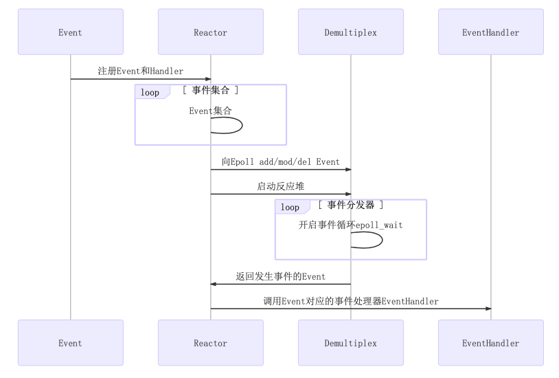
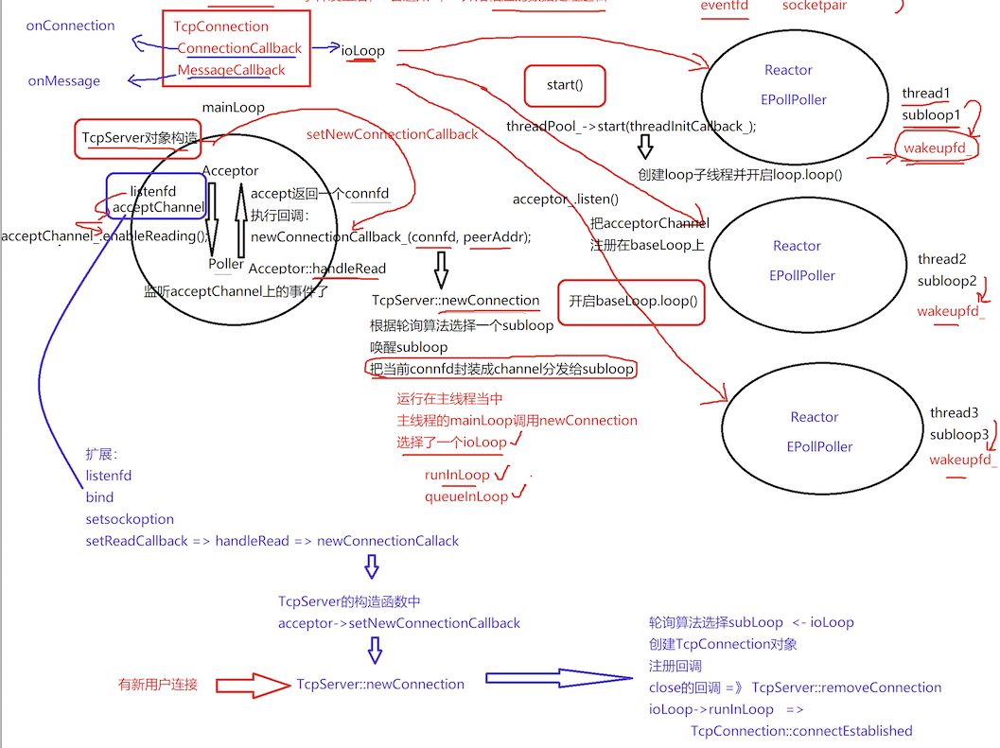

## Muduo Learning

### 1、代码梳理——独立部分

#### noncopyable
- delete 拷贝构造和赋值构造
- default 正常构造和析构

#### Timestamp
- 封装 time(NULL) 
- 提供 now() 和 toString() 方法

### 2、代码梳理——核心代码

#### Channel
- 封装 fd, events, revents
    - fd: poller 监听的 fd，一种是 listenfd，一种是 connfd
    - events: fd 感兴趣的事件
    - revents: poller 返回的具体事件，被 EPollPoller::fillActiveChannels 具体设置

- 一系列的 callbacks

#### Poller 和 EPollPoller - DeMultiplex
- Poller 是基类，提供具体的接口的抽象类
    - unordered_map<int, Channel*> channelMaps 保存被监听的 fd 列表
- EPollPoller，继承 Poller，默认维护大小为 16 的 vector events_
    - poll -> epoll_wait
    - update -> updateChannel -> epoll_ctl

#### EventLoop - Reactor
- 管理 channels 和 poller
    - ChannelList activateChannels_
    - unique_ptr poller_

- wakeupFd 以及 unique_ptr 管理的 wakeupChannel
    - eventfd() 系统调用实现线程之间的通信
    - 当 mainLoop 获取一个新用户的 connfd，通过轮询算法选择一个 subloop，通过该成员唤醒subloop 处理 channel

- runInLoop: 在当前 loop 中执行回调
- queueInLoop: 通过 wakeup() 唤醒对应的 loop 执行回调

#### Thread 和 EventLoopThread

- Thread 类利用 thread 头文件封装了线程的 join, start 等方法
    - start 方法新开一个线程执行 func 回调，其中使用 semaphore 等待 tid 的生成
    - 使用智能指针管理 thread_ 对象

- EventLoopThread 完美体现 one loop per thread
    - startLoop 开启一个事件循环，创建新线程
        - 包含 Thread 对象 thread_ 并通过 bind 绑定自己的 ThreadFunc 函数
        - 线程执行函数 ThreadFunc 每次执行都会创建一个 EventLoop 对象

#### EventLoopThreadPool
- 管理 EventLoopThread 以及 EventLoop，vector 
- start 方法创建 numThreads_ 个线程，并获取对应的 loop, one loop per thread，分别存储在 threads_ 和 loops_ 中，底层调用 EventLoopThread::startLoop 创建 loop
- getNextLoop 方法轮询获取下一个 subLoop

#### Socket
- 封装了 socket 操作：bind listen accept
- 提供 shutdownWrite() 关闭写端

#### Acceptor
- 主要封装 listenfd 的相关操作
- acceptSocket_ 以及 acceptChannel_, 设置回调，监听新用户
    - 主要关注 channel 的 readCallback，绑定自己的 handleRead 函数
    - handleRead 中通过上层设置 newConnectionCallback_ 处理新用户的 connfd

#### Buffer
- 缓冲区，nonblocking IO
- 应用写数据 -> buffer -> Tcp 发送缓冲区 -> send
- 通过 prependable | readerIndex | writerIndex 思想实现

#### TcpConnection
- 一个连接成功的客户端包含一个 TcpConnection
- 设置 connfdChannel 的回调，包括读写、错误、关闭等，acceptChannel 只关注读的回调
- 回调绑定的都是自己的 handleRead(), handleWrite(), handleClose(), handleError() 函数
- 发送数据 send, 实际使用 sendInLoop 发送数据，因为如果应用写的快，而内核发送数据慢，需要把发送数据写入缓冲区

#### TcpServer
- 最上层的类，提供给用户使用 muduo 编写服务器程序
- 管理 Acceptr, 设置 newConnectionCallback 回调
    - Acceptor: 创建一个非阻塞的 listenfd，socket bind listen 然后绑定 handleRead 获取新用户的 connfd
    - handleRead 中使用 newConnectionCallback 回调
- 管理 EventLoopThreadPool, 设置底层线程数量，不包括 baseLoop
    - ConnectionMap connections_

### 3、简单例子
参考：[test_mymuduo.cpp](./example/test_mymuduo.cpp)
```cpp
EventLoop loop;
InetAddress addr(8080);
EchoServer server(&loop, addr, "EchoServer-01"); // Acceptor non-blocking listenfd create bind
server.start(); // listen  loopthread  listenfd => acceptChannel => mainLoop =>
loop.loop(); // 启动 mainLoop 的底层 Poller
```

### 4、一键部署

```sh
# 正常模式
sudo ./autobuild.sh 

# DEBUG 模式
sudo ./autobuild.sh DEBUG
```

### 5、亮点

#### 5.1 eventfd()
EventLoop 中使用了 eventfd 来调用 wakeup()，让 mainloop 唤醒 subloop 的 epoll_wait 阻塞
> - mainLoop 和 subLoop 之间没有使用同步队列，没有使用生产者消费者模型，而是使用 eventfd() 创建 wakeupFd 作为线程之间的通知唤醒逻辑，效率是很高的
> - Libevent 中使用 socketpair 基于 AF_UNIX 创建双向管道用于线程之间的通信

==注意多线程的之间的通信方式==
这里并没有使用传统的「生产者消费者模型的安全队列」，而是直接使用 eventfd() 作为多线程之间的唤醒机制，底层在于 runInLoop 和 queueInLoop（参考 [EventLoop.cpp](EventLoop.cpp)）
- 如果当前线程就是 EventLoop 所在线程直接直接回调
- 否则就直接 queueInLoop，并且 wakeup EventLoop 所在线程
```cpp
// 在当前 loop 中执行 cb
void EventLoop::runInLoop(Functor cb) {
    if (isInLoopThread()) {  // 在当前的 loop 线程中执行 cb
        cb();
    } else {  // 在非当前 loop 线程中执行 cb，就需要唤醒 loop 所在线程，执行 cb
        queueInLoop(cb);
    }
}

// 把 cb 放入队列中，唤醒 loop 所在的线程，执行 cb
void EventLoop::queueInLoop(Functor cb) {
    {
        std::unique_lock<std::mutex> lock(mutex_);
        pendingFunctors_.emplace_back(cb);
    }

    // 唤醒相应的，需要执行上面回调操作的 loop 的线程了
    //!NOTE: callingPendingFunctors_ 当前 loop 正在执行回调，但是 loop 又有了新的回调，因此还需要唤醒 poller 以便再次执行
    if (!isInLoopThread() || callingPendingFunctors_) {
        wakeup();  // 唤醒 loop 就在线程
    }
}
```


#### ==5.2 Buffer 设计==
**1. send 数据过程**
考虑一个场景程序想通过 TCP 发送 100k 字节的数据，但是 write() 系统调用只能写入 80k 字节的数据（TCP 内核缓冲区只有 80k 空间了），此时肯定不能原地等待，**因此需要 outputBuffer 来存储剩余的 20k 数据**
- 注意剩余 20k 数据写入 outputBuffer 的 writeIdx 其实地址（append() 函数调用）
- 然后注册 PULLOUT 事件（enableWriting() 注册写事件）
- 最后通过绑定的回调 handleWrite() 将 outputBuffer 之前的数据发送过去，从 readIdx 开始读取（注意理解 buffer 的 readIdx 和 writeIdx 下标用法，十分巧妙）

**2. read 数据过程**
TCP 是一个无边界的字节流协议，接收方必须要处理“收到的数据尚不构成一条完整的消息”和“一次收到两条消息的数据”等等情况。一个常见的场景是，发送方 send 了两条 10k 字节的消息（共 20k），接受方收到数据很多情况

网络库在处理“socket 可读”事件的时候，必须一次性把 socket 里的数据读完（从操作系统 buffer 搬到应用层 buffer），否则会反复触发 POLLIN 事件，造成 busy-loop。(muduo 采用 LT 触发模式)

**所以需要要有 inputBuffer 来方便程序一次性处理数据**，当读事件 POLLIN 触发之后，TcpConnection 从 socket 读取读取数据放在 inputBuffer 中（使用 readv 从 socket 中分段读取到 iovec 中：writeIdx + 65535 字节），然后使用上层 TcpServer 设置的 messageCallback_ 回调读取 inputBuffer 中的数据（使用 retrieveAllAsString 从 readIdx 开始去）

**3. Buffer 接口理解**
谁会使用 Buffer？谁写谁读？TcpConnection 会有两个 Buffer 成员，input buffer 与 output buffer。
- input buffer，TcpConnection 会从 socket 读取数据，然后写入 input buffer（其实这一步是用 Buffer::readFd() 完成的）；「客户代码」从 input buffer 读取数据。
- output buffer，「客户代码」会把数据写入 output buffer（其实这一步是用 TcpConnection::send() 完成的）；TcpConnection 从 output buffer 读取数据并写入 socket。

**input 和 output 是针对客户代码而言，客户代码从 input 读，往 output 写。TcpConnection 的读写正好相反。**

**4. 线程安全问题**

Buffer 不是线程安全的，这么做是有意的，原因如下：
- 对于 input buffer，onMessage() 回调始终发生在该 TcpConnection 所属的那个 IO 线程，应用程序应该在 onMessage() 完成对 input buffer 的操作，并且不要把 input buffer 暴露给其他线程。这样所有对 input buffer 的操作都在同一个线程，Buffer class 不必是线程安全的。
- 对于 output buffer，应用程序不会直接操作它，而是调用 TcpConnection::send() 来发送数据，后者是线程安全的。


#### 5.3 multiple reators
1. 采用 Reactor 模型和多线程结合的方式，实现了高并发非阻塞网络库，mainReator 和 subReator，实际上是 mainLoop 和 subLoop，包括 Channel 和 Poller
2. EventLoop 就是图中的 Reactor 和 Demultiplex


#### 5.4 效率高
1. 在 EventLoop 中注册回调 cb 至 pendingFunctors_，并在 doPendingFunctors 中通过 swap() 的方式，快速换出注册的回调，只在 swap() 时加锁，减少代码临界区长度，提升效率。
> 若不通过 swap() 的方式去处理，而是加锁执行 pendingFunctors 中的回调，然后解锁，会出现什么问题呢？
> - 临界区过大，锁降低了服务器响应效率 
> - 若执行的回调中执行queueInLoop需要抢占锁时，会发生死锁）

2. Logger可以设置日志等级，调试代码时可以开启DEBUG打印日志；若启动服务器，由于日志会影响服务器性能，可适当关闭DEBUG相关日志输出

#### 5.5 C++11
1. 使用 C++11 改写原有 muduo 库，不依赖 boost 库
2. 在 Thread 中通过 C++ Lambda 表达式以及信号量机制保证线程创建时的有序性，只有当线程获取到了其自己的 tid 后，才算启动线程完毕
3. TcpConnection 继承自 enable_shared_from_this，TcpConnection 对象可以调用 shared_from_this() 方法给其内部回调函数，相当于创建了一个带引用计数的shared_ptr，可参考链接 [link](https://blog.csdn.net/gc348342215/article/details/123215888)，同时通过 tie() 方式解决了 TcpConnection 对象生命周期先于 Channel 结束的情况


### 6、整体流程梳理



### 7、参考

- 施磊--【高级】手写C++ Muduo网络库项目-掌握高性能网络库实现原理
- [Muduo 设计与实现之一：Buffer 类的设计](https://www.cnblogs.com/Solstice/archive/2011/04/17/2018801.html)
- [深入掌握C++智能指针](https://blog.csdn.net/QIANGWEIYUAN/article/details/88562935)
- [C++智能指针的enable_shared_from_this和shared_from_this机制](https://blog.csdn.net/QIANGWEIYUAN/article/details/88973735)
- [C++ muduo网络库知识分享01 - Linux平台下muduo网络库源码编译安装](https://blog.csdn.net/QIANGWEIYUAN/article/details/89023980)
- [C++11 - thread多线程编程，线程互斥和同步通信，死锁问题分析解决](https://blog.csdn.net/QIANGWEIYUAN/article/details/88792621)
